# SO-101 robot harness for drawing

A harness that turns an SO-101 arm (LeRobot, Feetech STS3215 servos) into a pen plotter: kinematics,
paper calibration, stroke designs, a three-camera live viewer, and agent skills. An AI coding agent
wrote the control code from scratch and closed the loop by looking at the camera images.
Two landmark drawings were made, each on its own sheet:

### 1. ArtScience Museum, Singapore (first drawing, taped Sharpie)

Rough and only partly legible: the water lines, platform and petal fan came out, but the petals are
faint and the sheet already had marks from an earlier failed attempt. Almost everything in
[docs/LESSONS_LEARNED.md](docs/LESSONS_LEARNED.md) was learned on this one.

| Reference | Plan (hand-authored strokes) | Drawn by the robot |
| --- | --- | --- |
| 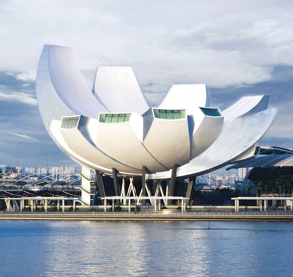 | 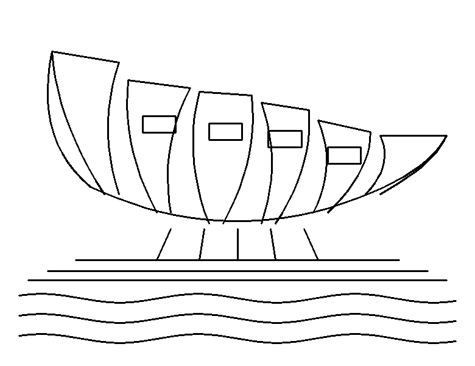 | 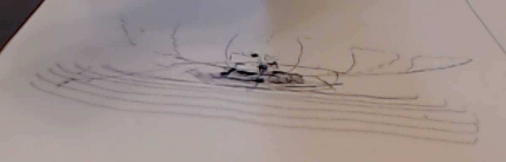 |

### 2. Petronas Twin Towers, Kuala Lumpur (second drawing, bare refill at 90°)

The successful one: 88 strokes, 130 × 170 mm on US-letter paper, about 6.5 minutes.

| Reference | Plan (hand-authored strokes) | Drawn by the robot |
| --- | --- | --- |
| 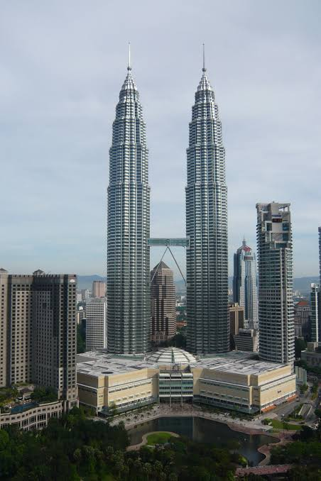 | 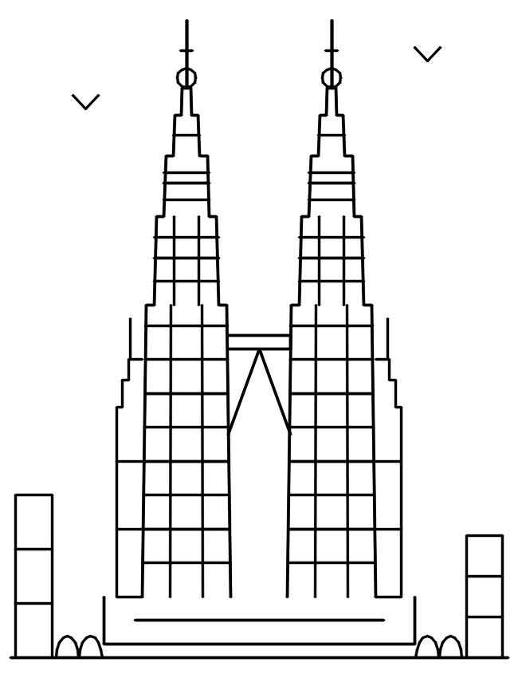 | 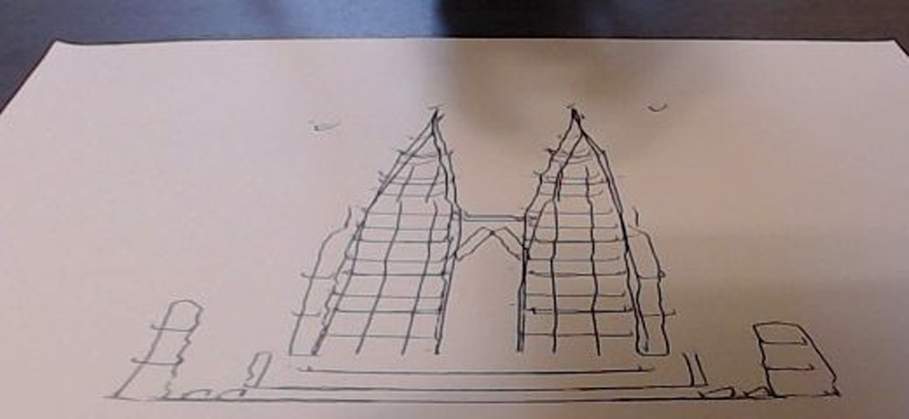 |

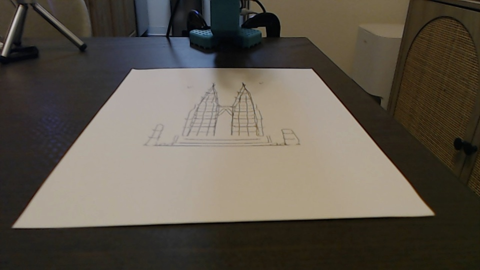

---

## Contents

1. [Hardware](#hardware)
2. [How it works](#how-it-works)
3. [Quick start](#quick-start)
4. [Repeat the experiment with a different drawing](#repeat-the-experiment-with-a-different-drawing)
5. [Repository layout](#repository-layout)
6. [What was done, step by step](#what-was-done-step-by-step)
7. [Results gallery](#results-gallery)
8. [Agent skills / tool calling](#agent-skills--tool-calling)
9. Deep dives: [cameras](docs/CAMERAS.md) · [calibration](docs/CALIBRATION.md) ·
   [difficulties & lessons](docs/LESSONS_LEARNED.md) · [new drawing guide](docs/NEW_DRAWING_GUIDE.md) ·
   [tool API](docs/TOOL_API.md) · [camera dashboard](camera_dashboard/README.md)

---

## Hardware

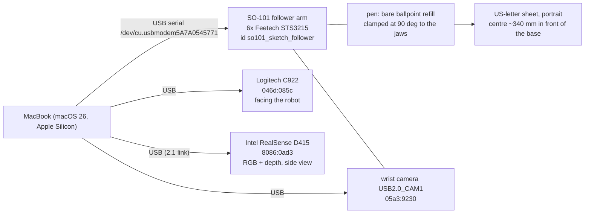

Top view of the table (robot base frame: x forward, y left, z up):

```text
                      viewer side (C922 on a box, facing the robot)
                 +-----------------------------------------------+
                 |              US-letter sheet (portrait)        |
                 |        +--------------------------+            |
                 |        |  drawing area 130 x 170  |  <- u (viewer's right)
                 |        |       centre x=325 mm    |            |
                 |        +--------------------------+            |
                 |                    | v (toward robot)          |
                 +-----------------------------------------------+
   D415 on a tripod                   |
   at the side, oblique  ->      [ SO-101 base ]  (x points toward the viewer)
```

## How it works

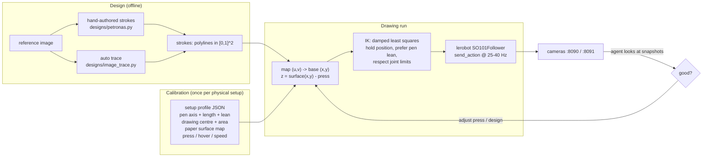

The pieces, in the order a drawing flows through them:

1. **Design**: a list of strokes in normalised coordinates (`u` right, `v` up as in the picture).
   The final Petronas drawing is hand-authored: silhouette with tiered setbacks, spires,
   skybridge with inverted-V legs, floor bands, then a detail layer (facets, ribbon floors, bustle
   annexes, pinnacle balls, park trees, background blocks, birds). Outlines are drawn twice.
2. **Setup profile** (`calibration/setups/*.json`): where the pen tip is relative to the gripper,
   which way it leans, where the drawing sits, and the measured paper height map.
3. **Kinematics** (`so101_sketch/kinematics.py`): numpy FK from the `so101_new_calib` URDF and an IK
   that treats position as hard, pen lean as soft and joint limits as penalties.
4. **Paper height**: the commanded z where the pen touches is **+8.5 mm**, not 0, because the
   stretched arm sags. It was measured with **ink ladders** (dashes at known heights, read from the
   camera). Servo-lag contact probing worked for the stiff first mount but not for the flexible refill.
5. **Execution** (`so101_sketch/sketcher.py`): joint-space home move from a known posture, then for
   each stroke travel at hover height, lower, draw at 25 mm/s with 1 mm steps, lift.
6. **Verification**: park the arm toward the robot, snapshot the C922 at 720p, crop, and compare
   with the plan.

The draw loop for one stroke:

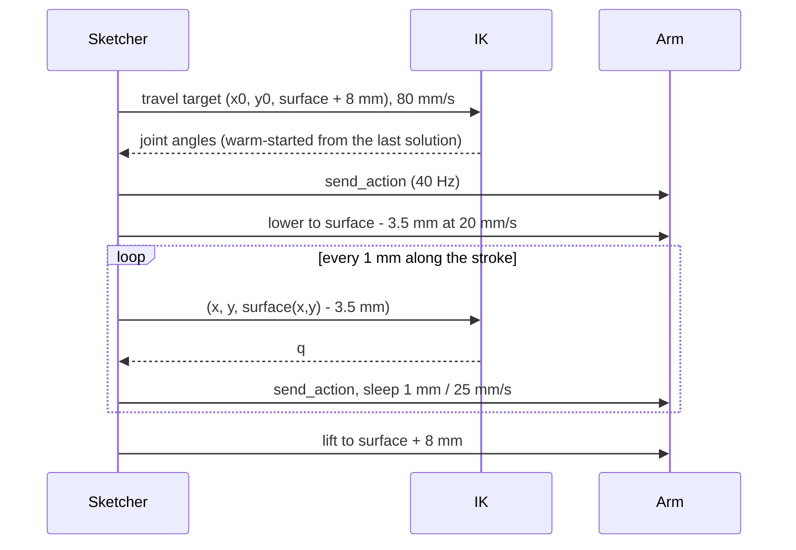

## Quick start

```bash
# 1. Python env (lerobot + numpy + opencv)
conda create -n python3 python=3.12 -y   # once
conda activate python3
pip install -r requirements.txt
#    (The sessions were run with the interpreter of an existing lerobot 0.6.1 virtualenv.)

# 2. Camera dashboards (separate venv, see camera_dashboard/README.md)
cd camera_dashboard && python3 -m venv .venv && .venv/bin/pip install -r requirements.txt
./supervise.sh --detach uvc 8090 server.log          # C922 + wrist cam -> http://127.0.0.1:8090
sudo ./supervise.sh --detach realsense 8091          # D415 RGB + depth -> http://127.0.0.1:8091
cd ..

# 3. Offline checks (no robot needed)
python scripts/so101_sketch.py preview petronas      # work/live/petronas-preview.png
python scripts/so101_sketch.py dry-run petronas      # reachability + time estimate

# 4. Draw (same physical setup as calibration/setups/pen90_letter_portrait.json)
python scripts/so101_sketch.py status                # read-only sanity check
python scripts/so101_sketch.py draw petronas         # home -> draw -> park -> snapshots
```

## Repeat the experiment with a different drawing

Full walkthrough with a decision flowchart: [docs/NEW_DRAWING_GUIDE.md](docs/NEW_DRAWING_GUIDE.md).
Short version:

```bash
# same arm / pen / sheet position -> just a new design
python scripts/so101_sketch.py trace references/my_picture.jpg --name my_picture
python scripts/so101_sketch.py preview strokes/my_picture.json
python scripts/so101_sketch.py dry-run strokes/my_picture.json          # must report 0 failures
python scripts/so101_sketch.py draw strokes/my_picture.json --tag my_picture

# anything physical changed -> new setup profile first
python scripts/so101_sketch.py init-setup my_setup --area-mm 130,170   # pen tip resting on the sheet centre
python scripts/so101_sketch.py ladder --setup calibration/setups/my_setup.json
python scripts/so101_sketch.py set-surface --setup calibration/setups/my_setup.json --z0-mm 8.5 --slope-x 15
```

Auto-tracing gets a recognizable result quickly; hand-authored strokes look much better on paper:

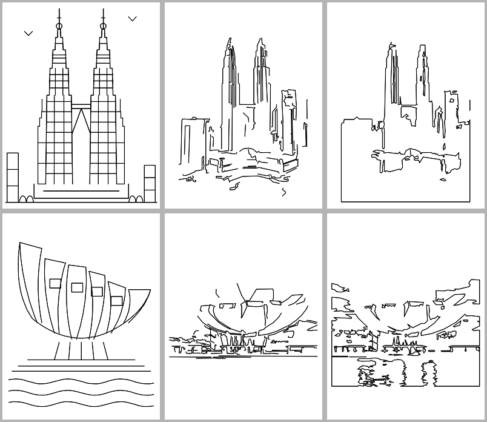

*Top row: Petronas hand-authored, traced (edges), traced (outline). Bottom row: same for the ArtScience Museum.*

## Repository layout

```text
.
├── README.md                     this file
├── requirements.txt              robot-side Python deps
├── so101_sketch/                 the library
│   ├── config.py                 port, robot id, joint limits, camera ids, paths
│   ├── kinematics.py             URDF FK, PenModel, two-pass DLS IK
│   ├── hardware.py               lerobot SO101Follower connect / read / send
│   ├── cameras.py                stills from the dashboards (OpenCV fallback)
│   ├── setup_profile.py          SetupProfile + PaperSurface (one JSON per physical setup)
│   ├── sketcher.py               controller: home, moves, draw, ink ladder, servo-lag probe, dry run
│   ├── session.py                high-level API: SketchSession, preview, dry_run, capture_setup
│   └── designs/                  stroke designs
│       ├── petronas.py           Petronas Twin Towers (base + details + full)
│       ├── artscience.py         ArtScience Museum
│       ├── image_trace.py        image -> strokes (Canny edges / threshold outlines)
│       └── geometry.py           resample, bezier, bold, ordering, preview, JSON io
├── scripts/
│   └── so101_sketch.py           CLI for everything (was sketch_museum.py)
├── calibration/
│   ├── lerobot_so101_sketch_follower.json   lerobot joint calibration of this arm
│   └── setups/
│       ├── pen90_letter_portrait.json       current setup (final Petronas drawing)
│       └── history_artscience_taped_sharpie.json  first setup, for the record
├── strokes/                      traced example designs (so101-strokes/v1 JSON)
├── references/                   reference photos of the landmarks
├── camera_dashboard/             live viewer: camera_server.py, supervise.sh, static/ (see its README)
├── docs/                         CAMERAS, CALIBRATION, LESSONS_LEARNED, NEW_DRAWING_GUIDE, TOOL_API, images/
├── .cursor/skills/               agent skills: so101-pen-drawing, so101-camera-dashboard
└── work/                         runtime output (snapshots, previews, ladder logs), git-ignored
```

## What was done, step by step

| # | Step | Outcome |
| --- | --- | --- |
| 1 | Built a local camera dashboard for the C922, wrist cam and D415 with per-stream metadata | Webcams live at once; D415 blocked by macOS USB ownership (fixed later by running it as root) |
| 2 | First drawing attempt by offsetting joints | Blob only: moving the elbow changes pen height |
| 3 | Wrote FK from the URDF and a damped-least-squares IK with soft pen lean and joint-limit penalties | Tip held on a plane; corners near the robot needed a two-pass IK |
| 4 | Contact detection from Feetech position error (P gain 32, slope + drop + confirmation) | Paper map for the stiff taped Sharpie; ~10 mm model tilt across the reach |
| 5 | ArtScience Museum drawn on a used sheet | Water lines, platform and petal fan visible; petals faint; rough |
| 6 | New portrait sheet; pen stripped to a bare refill clamped at 90° | Pen model re-derived automatically (22.3 mm, −10.8° lean) |
| 7 | Probing failed (flexible refill) → ink ladders | Paper at commanded z = 8.5 mm + 15 mm/m slope |
| 8 | Petronas base layer (18 strokes) | Recognizable, light lines |
| 9 | Detail layer practised on the same sheet (52 strokes) | Registered within ~1 mm on top of the first pass |
| 10 | Final: fresh sheet, 88 strokes, outlines doubled, press 3.5 mm | The result shown above |
| 11 | Dashboards split: :8090 webcams as the user, :8091 D415 as root; MJPG 30 fps | All four streams stable |
| 12 | Repository cleanup: library + CLI + profiles + docs + skills (this commit) | Repeatable for new drawings |

Details and the full list of problems: [docs/LESSONS_LEARNED.md](docs/LESSONS_LEARNED.md).

## Results gallery

| ArtScience: start (taped Sharpie) | ArtScience: final sheet |
| --- | --- |
| 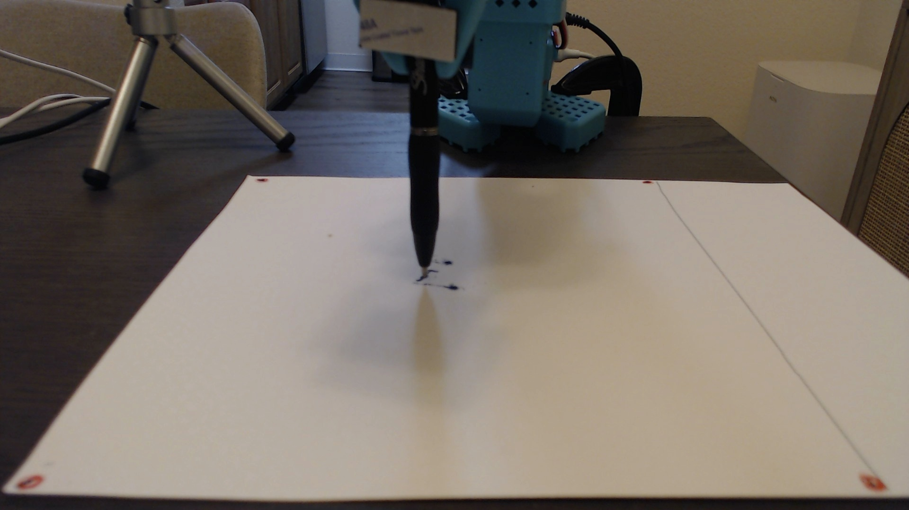 | 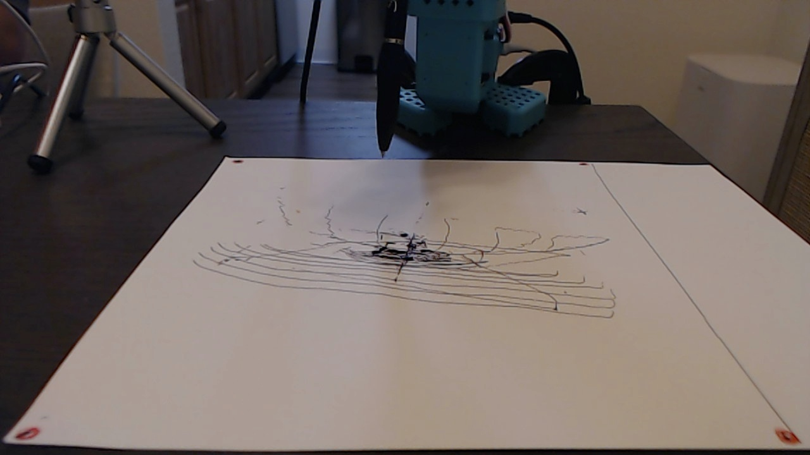 |

| Petronas: 90° refill mount | First ink ladder (the pen dragged) |
| --- | --- |
| 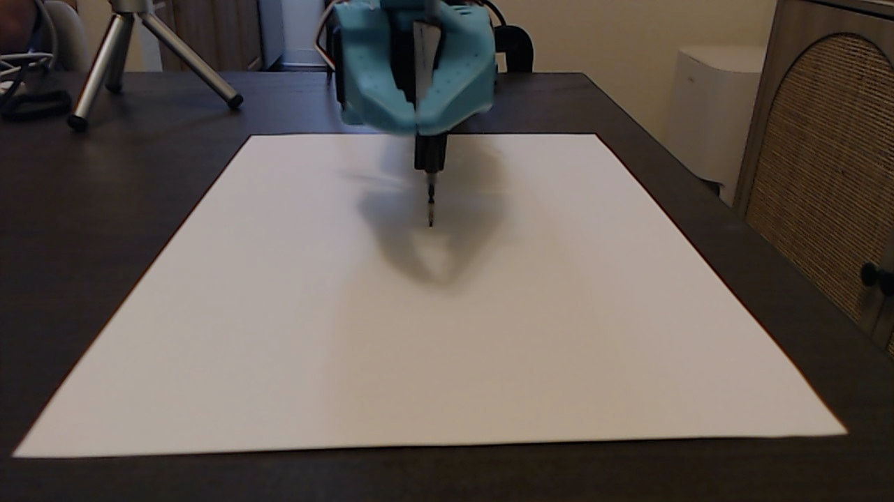 |  |

| Petronas: first pass | Detail practice on the same sheet |
| --- | --- |
| 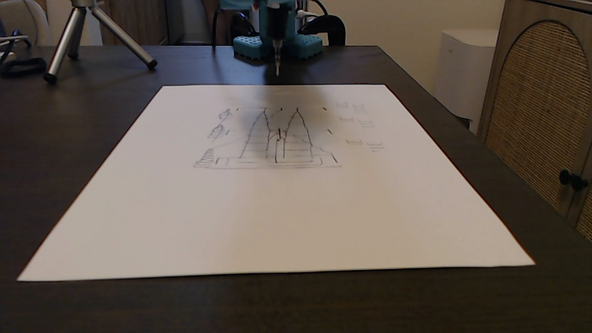 | 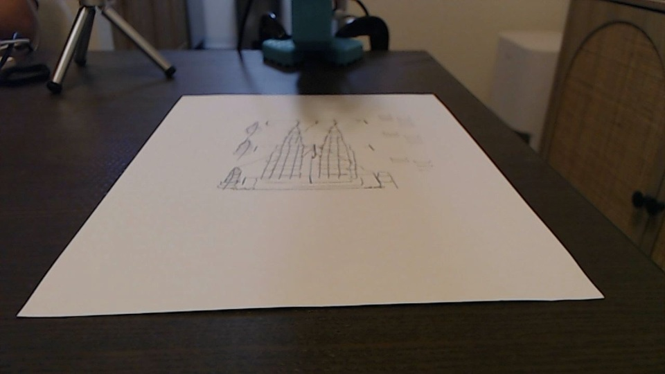 |

| Final (C922) | Final (wrist cam) |
| --- | --- |
|  | 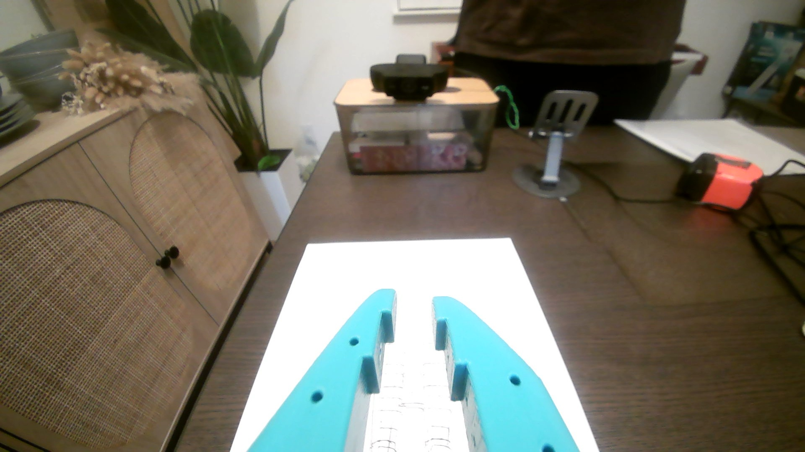 |

## Agent skills / tool calling

* `.cursor/skills/so101-pen-drawing/SKILL.md`: the drawing workflow (dry-run, draw, verify,
  calibrate) for agents.
* `.cursor/skills/so101-camera-dashboard/SKILL.md`: starting, checking and debugging the two dashboards.
* [docs/TOOL_API.md](docs/TOOL_API.md): every CLI command as a tool (inputs, `--json` outputs) and
  the Python API (`SketchSession`, `preview`, `dry_run`, `trace_image`, `SetupProfile`).

## Known limitations

* Open loop: cameras verify, they do not steer. Line wobble comes from the flexible refill and
  servo backlash.
* The paper map is valid only for the mount/posture it was measured with; re-measure after any
  physical change.
* Dry-run time estimates ignore IK compute time; real runs are about 1.3× longer.
* The D415 needs root on macOS; depth is too coarse at this range to see ink or millimetre heights.
