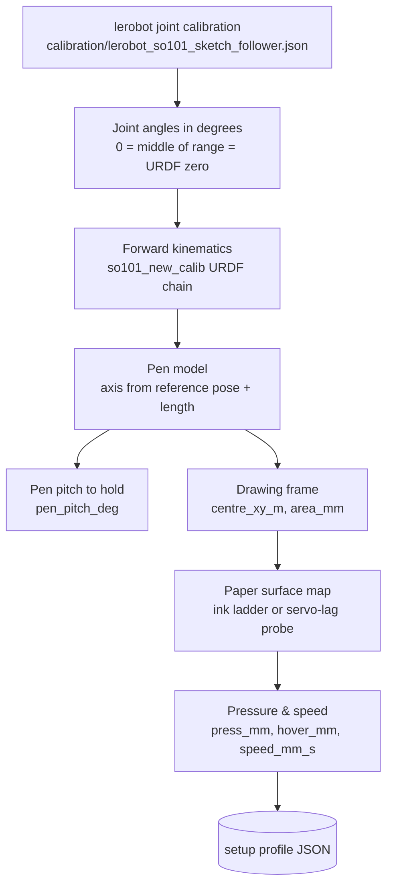
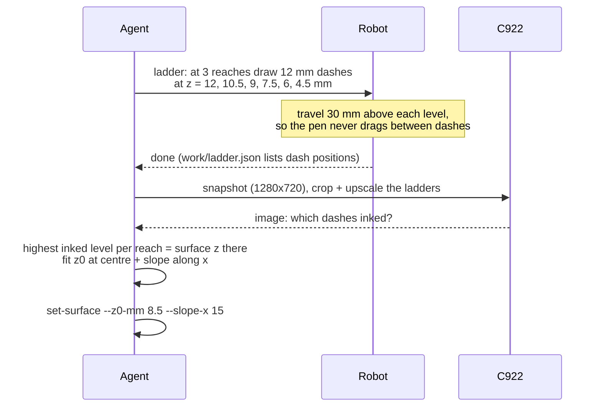
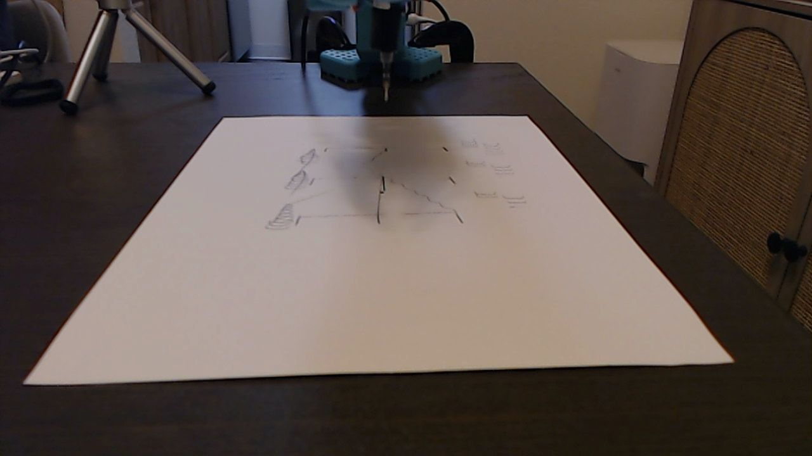
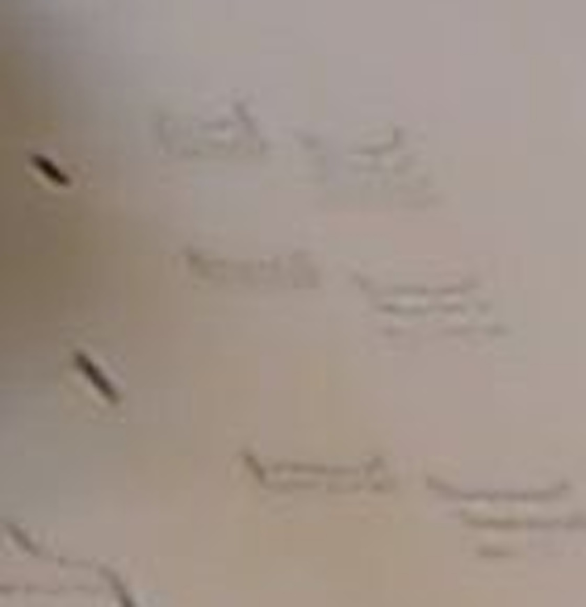

# Calibration

Everything the robot needs to put ink exactly where a design says, and how each piece was
measured. All of it ends up in one **setup profile** JSON
(`calibration/setups/<name>.json`, class `SetupProfile`).



## 1. Joint calibration (lerobot)

`calibration/lerobot_so101_sketch_follower.json` is a copy of
`~/.cache/huggingface/lerobot/calibration/robots/so_follower/so101_sketch_follower.json`, made
with lerobot's standard SO-101 calibration (move every joint through its range). With
`use_degrees=True`, lerobot reports **0° at the middle of each joint's calibrated tick range**,
which is exactly the zero of the `so101_new_calib.urdf` model, so joint readings feed the FK with
no offsets.

Soft joint limits used by the IK are the calibrated ranges minus 4° of margin
(`config.LIMITS_DEG`), e.g. `wrist_flex` ±97.5°.

To use another arm: calibrate with lerobot, copy its file here, set `SO101_ID` / `SO101_PORT`
(or edit `so101_sketch/config.py`) and update `CAL_TICKS` from the new file.

## 2. Kinematics and pen model

* **FK** (`kinematics.py`): homogeneous transforms transcribed from `so101_new_calib.urdf`
  (base → shoulder_pan → shoulder_lift → elbow_flex → wrist_flex → wrist_roll → gripper frame).
  numpy only; lerobot's placo-based kinematics was not installed and was not needed.
* **Pen model**: tip = gripper-frame origin + `L` × (the gripper-frame axis that points most
  nearly down in a *reference pose*). Picking the axis from data means the same code works for a
  pen taped along the jaws (first setup) and a refill clamped at 90° (second setup).
  `L` = `pen_length_mm`; `0` means "estimate it assuming the tip is resting on the table plane
  z = 0 right now".
* **IK**: damped least squares over pan/lift/elbow/wrist_flex (wrist_roll and gripper frozen).
  Residual = tip position error (hard), pen pitch error × 0.03 m/rad (soft), joint-limit hinge
  penalties (1° over = 5 mm). Two passes: strong pitch weight first (chooses the posture), then
  weight 0.002 to nail the position. Tolerance 1.5 mm.
* **Pen pitch** is the pen's lean from vertical measured in the arm's plane. It must be a fixed
  number in the profile, never re-derived from wherever the arm is parked (a crashed/parked pose
  once produced a 21° lean and invalidated the whole paper map).
* **Home seed**: a known-good joint posture over the sheet. The first move of every job is a
  joint-space move seeded from it, otherwise the IK can settle on the other elbow branch.

Check reachability offline before drawing:

```bash
python scripts/so101_sketch.py dry-run petronas      # every stroke through the IK, no robot
```

## 3. Drawing frame

`centre_xy_m` is the drawing centre in robot-base metres; `area_mm` is the rectangle
`[width, height]`. Axes: `u` = viewer's right (viewer stands opposite the robot), `v` = toward
the robot, so designs appear upright to the C922. The frame rotates with the radial direction
of the centre.

For the final setup the user put the pen tip on the sheet centre (x ≈ 340 mm). The drawing
centre was pulled 15 mm toward the robot (x = 325 mm) because the far edge is near the arm's
reach limit; a 130 × 170 mm rectangle there is reachable everywhere with the pen lean held
within −15° … −10°.

## 4. Paper surface map

The commanded z at which the pen just touches the paper is **not 0**, even though the robot
base sits on the same table. It absorbs gravity sag (several mm, growing with reach), calibration
offsets and model error. The map is only valid for the pen mount and posture it was measured
with. Two ways to measure it:

### 4a. Ink ladder (works with any pen; used for the final drawing)



```bash
python scripts/so101_sketch.py ladder                       # dashes in the right margin
python scripts/so101_sketch.py snap --tag ladder            # (ladder also snapshots)
python scripts/so101_sketch.py set-surface --z0-mm 8.5 --slope-x 15
```

What happened in practice:

| First ladder (levels +2 … −12 mm, travel +10 mm) | Fine ladder (12 … 4.5 mm in 1.5 mm steps) |
| --- | --- |
|  |  |
| Every level was below the real surface; the pen also dragged between dashes because "+10 mm" travel was still under the paper. Dense squiggles on the left, zig-zags in the middle. | Only the lowest few levels ink. Reading the three clusters gave ≈ 8 mm (near), 8.5 mm (middle), 9.5 mm (far): **z = 8.5 mm + 15 mm/m · (x − 0.325)**. |

### 4b. Servo-lag contact probe (stiff pen mounts only)

Lower the pen slowly (2 mm/s) and watch the Feetech servos: in free air the error
`Present_Position − Goal_Position` of the pitch joints (projected on the "down" direction) is flat;
once the pen is blocked it runs away. Contact = slope > 1.8 ticks/mm over the last 3 mm **and**
≥ 9 ticks below the running maximum, then **confirmed** by ≥ 5 more ticks over the next 3 mm
(stiction transients fade, real contact keeps building). The knee is extrapolated back along the
slope. A centre point plus a 3 × 3 grid spiralling outwards is fitted with a plane (< 7 points)
or a quadratic (≥ 7), with outlier re-probing.

```bash
python scripts/so101_sketch.py diag --no-detect     # log one full descent, inspect the curve
python scripts/so101_sketch.py probe                # fit and save the surface
```

With the taped Sharpie this worked (plane tilting ~10 mm over 70 mm of reach, residuals
< 1.3 mm). With the bare refill it **cannot** work: the refill bends ~9 mm before the servos feel
anything, and at 35 cm reach the shoulder signal was only ~1.3 ticks/mm against ±8 ticks of
free-air drift. That is why `surface_method` is part of the profile.

Settings that matter for probing: Feetech P gain 32 (lerobot's default 16 sags more and blurs
the signal), slow ramp, wait for the lag to settle before descending, ignore the first 5 mm.

## 5. Pressure, travel, speed

| Setting | Final value | Notes |
| --- | --- | --- |
| `press_mm` | 3.5 | Commanded depth below the surface map. 3.0 gave light grey lines with the refill; deeper = darker but more wobble at corners |
| `hover_mm` | 8 | Pen-up travel height above the map |
| `speed_mm_s` | 25 | Drawing speed; travel moves run at 80 mm/s |
| `step_mm` | 1 | Polyline resampling while drawing |
| Line weight | outlines drawn twice | `bold()` adds each outline stroke reversed; the refill lags on the way back, which thickens the line without offsetting it |

## 6. The setup profiles in this repo

| File | Setup | Status |
| --- | --- | --- |
| `pen90_letter_portrait.json` | Bare refill at 90° to the jaws, letter sheet in portrait at x ≈ 340 mm | Current. Produced the final Petronas drawing |
| `history_artscience_taped_sharpie.json` | Sharpie taped along the jaws, sheet at x ≈ 170 mm | Historical record of the ArtScience attempt; the mount no longer exists |

Re-use a profile as long as the arm, pen mount and sheet position are unchanged (place a new sheet
exactly where the old one was; compare with the last C922 image). Anything else → new profile
(see [NEW_DRAWING_GUIDE.md](NEW_DRAWING_GUIDE.md)).
