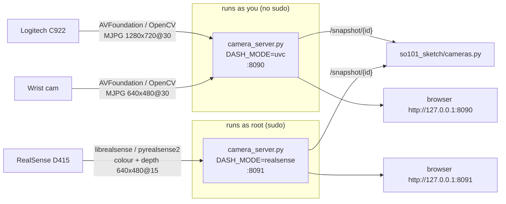
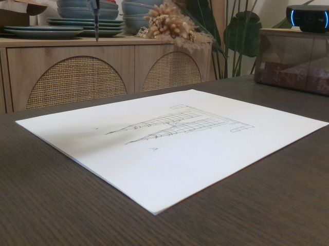
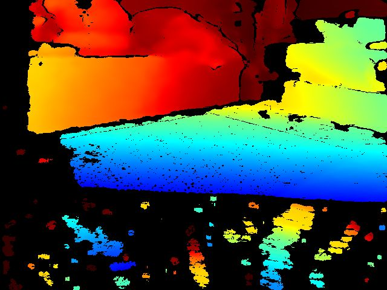

# Cameras

Three cameras watch the robot. None of them is used for closed-loop control; they are the
agent's eyes for **verifying ink on paper**, **reading calibration marks**, and letting a human
follow along in the browser.

| Camera | USB id | Where it sits | What it is good for |
| --- | --- | --- | --- |
| Logitech C922 Pro Stream | `046d:085c` | On a clear storage box across the table, facing the robot (the "viewer" position) | Main verification view: whole sheet, robot in the background. All results in this repo are judged from it |
| SO-101 wrist camera (`USB2.0_CAM1`) | `05a3:9230` | On the gripper | With the taped Sharpie it looked straight down the pen; after the 90° refill mount the gripper is horizontal, so it looks forward and only sees the sheet under the jaws |
| Intel RealSense D415 | `8086:0ad3` | Side of the table, looking obliquely across the sheet | Depth (table plane vs. robot/wall) and an extra RGB angle. Linked at USB 2.1, so 640×480 @ 15 fps |

The MacBook FaceTime camera is deliberately hidden from the dashboard.

## Live viewer: two dashboards



| URL | Tiles | Start it with |
| --- | --- | --- |
| http://127.0.0.1:8090 | C922 + wrist cam | `cd camera_dashboard && ./supervise.sh --detach uvc 8090 server.log` |
| http://127.0.0.1:8091 | D415 RGB + colorized depth | `cd camera_dashboard && sudo ./supervise.sh --detach realsense 8091` |

`supervise.sh` restarts the server if it dies and detaches into its own session (so it survives
the terminal, the agent's shell, or the `sudo`/`osascript` helper exiting).

### Why two processes?

On macOS 26 (Apple Silicon) the two camera families need **opposite privileges**:

* `librealsense` talks to the D415 over libusb and must claim its USB interfaces. macOS's own UVC
  driver already owns them, and a normal user cannot detach a kernel driver, so every attempt
  fails with `failed to set power state` / `RS2_USB_STATUS_ACCESS` (and sometimes a segfault).
  As **root** the claim succeeds.
* macOS Camera permission (TCC) is granted **per user**. A root process gets "camera access
  denied" from AVFoundation and cannot open the C922 or the wrist cam.

So the webcams run in a user process and the D415 in a root process. Optionally
`D415_PROXY=http://127.0.0.1:8091 ./supervise.sh --detach uvc 8090 server.log` mirrors the D415
tiles into the :8090 page as well (the user process only fetches JPEGs from :8091, no sudo).

## What each camera sees

| C922 (final drawing) | Wrist cam (90° mount) |
| --- | --- |
|  |  |

| D415 RGB | D415 depth (blue = near table, red = far wall) |
| --- | --- |
|  |  |

Depth is too coarse to see ink or millimetre pen heights at this distance; it confirms the table
plane and the robot's position. The paper height was calibrated with ink ladders instead
(see [CALIBRATION.md](CALIBRATION.md)).

## Taking stills from code

```python
from so101_sketch.cameras import snapshot, snapshot_all
snapshot("c922", "after")          # -> work/live/after-c922.jpg
snapshot_all("check")              # c922, wrist, d415_rgb, d415_depth
```

or `python scripts/so101_sketch.py snap --tag check`. If the :8090 dashboard is down,
`snapshot()` falls back to opening the webcam directly with OpenCV (AVFoundation index 0 =
wrist, 2 = C922); this only works while no dashboard holds the camera.

To read fine detail (ink ladder dashes), crop and upscale the 1280×720 C922 frame; the
dashboard's original 640×480 was too blurry to count 1.5 mm ladder steps.

## Camera debugging history (what went wrong, in order)

1. **D415 invisible to the SDK.** It showed up as a UVC "Depth" camera to macOS but
   `librealsense` reported 0 devices, then `failed to set power state`. The dashboard's OpenCV
   fallback also opened the D415 as a webcam, which made the claim even less likely. The
   librealsense debug logs from those attempts showed `Found 0 RealSense devices` over and over.
   Fix: never open the D415 through AVFoundation, and run the D415 side as root.
2. **Dashboard crashes.** Native aborts inside librealsense killed the whole server, taking the
   webcam tiles down with it. Fix: `supervise.sh` restart loop, later the process split.
3. **Viewer kept dying with the agent's shell.** `nohup`/`disown` were not enough when the
   agent's shell was torn down. Fix: launch via Python `subprocess.Popen(start_new_session=True)`
   (what `supervise.sh --detach` does).
4. **Root fixed the D415 but broke the webcams.** A helper agent relaunched the dashboard with
   `sudo` → depth went live, C922/wrist failed (no TCC permission for root). Fix: the two-port split.
5. **`pkill` surprises.** `pkill -f "python app.py"` does not match the framework Python's
   `Python app.py` (capital P), while a looser pattern matched the *supervisor's* command line and
   killed the restart loop instead of the server. An orphaned server then held the port and the
   new supervisor crash-looped on `address already in use`, briefly stealing cameras on every
   attempt. Fix: kill by PID or by the exact supervisor command (`pkill -f "supervise.sh uvc"`).
6. **Snapshots too blurry for calibration.** 640×480 could not resolve ladder dashes. Fix:
   per-camera capture size (C922 at 1280×720).
7. **Wrist cam froze after a few seconds.** With the C922 at uncompressed 720p60 and the D415
   streaming, the shared USB 2 bus ran out of bandwidth and the cheap wrist cam stopped
   delivering frames (frame counter stuck, tile "stale"). Lowering only its resolution did not
   help. Fix: request **MJPG at 30 fps** for every webcam; both have been stable since.
