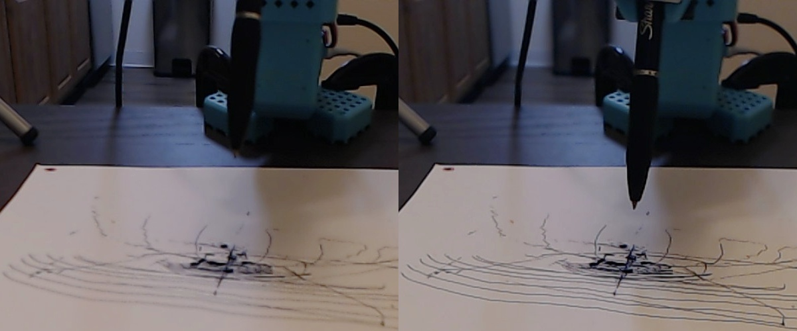
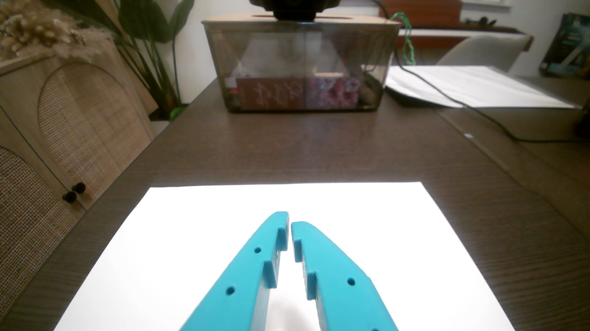
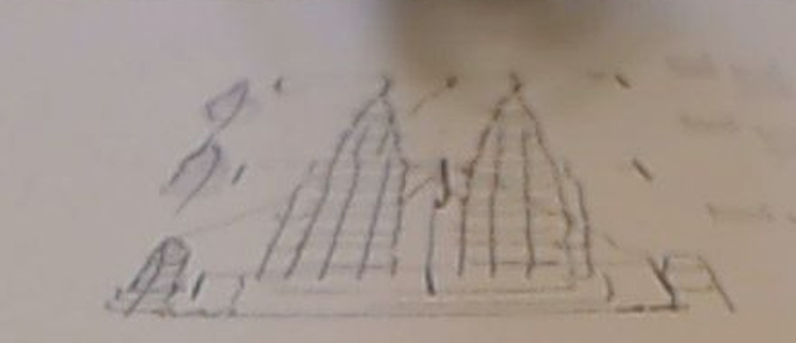

# Difficulties and lessons learned

A chronological account, reconstructed from the agent chat transcripts, terminal logs and camera
snapshots of the sessions on 2026-09-14 … 16. It is written so the next person (or agent) does not
repeat the same mistakes.

```mermaid
timeline
    title Project timeline
    Sep 14 night : Camera dashboard built (:8090) : D415 not visible to librealsense : First drawing attempt (joint offsets) only blobs
    Sep 15 : FK + IK from the URDF : servo-lag contact probing : ArtScience Museum attempt on a used sheet (rough, partly legible)
    Sep 16 early : New portrait sheet, further away : bare refill clamped at 90 deg : probing fails, ink ladders work
    Sep 16 02:15 : Petronas first pass (18 strokes) : detail practice (52 strokes) : final 88-stroke drawing on a fresh sheet
    Sep 16 02:45 : Dashboards split - :8090 webcams (user), :8091 D415 (root)
```

## Phase 0 — first attempts and the viewer (Sep 14–15)

| Problem | What we saw | Root cause | What fixed it |
| --- | --- | --- | --- |
| Drawing by joint offsets | The first approach moved `shoulder_lift` for pen-down and offset pan/elbow for position. Only a blob in the middle of the sheet | Moving the elbow also changes pen height, so the pen lost contact or dug in | Proper FK/IK holding the tip on the paper plane |
| Old experiments | The user stated that `so101-arm-experiments` was a failed experiment | — | Everything here was written from scratch (only that repo's virtualenv interpreter was used to run lerobot) |
| D415 | Tile errors: "Camera opened but is not delivering frames", "librealsense found 0 RealSense devices", "failed to set power state"; USB link at 2.0 | macOS UVC driver owns the D415 interfaces; libusb as a normal user cannot claim them | Run the D415 side of the dashboard as root (finally done on Sep 16) |
| Viewer down | `ERR_CONNECTION_REFUSED` on :8090; ports 8765/8766 from older viewers in the way | Crashes inside librealsense; old servers | Killed the old viewers, restart-loop supervisor |

## Phase 1 — ArtScience Museum with a taped Sharpie (Sep 15)


1. **Units bug.** Pen length passed in mm to a model expecting metres → absurd IK targets.
2. **`Goal_Position` and `Present_Load` read 0.** Not a fault: no goal had been written since
   power-up. Loads only become meaningful once the arm is actively holding a commanded pose.
3. **Corners unreachable.** Near the robot `wrist_flex` hit its +97.5° soft limit, so the pen could
   not stay vertical. Fix: pen pitch became a *soft* IK term, joint limits became hinge penalties,
   then a **two-pass IK** (strong pitch weight picks the posture, weak weight nails position)
   because a strong weight alone traded 2.7 mm of position for pitch.
4. **The arm sank a little on every connect.** lerobot's `configure()` briefly disables torque;
   the arm sags and torque re-locks at the sagged pose. Deriving the drawing centre from "where the
   pen is now" therefore drifted by centimetres across runs. Fix: store the frame (centre, pitch,
   pen length) and reuse it; keep one connection per job.
5. **Contact detection was the hardest part.**
   * First detector fired on the settling transient right after reaching hover (false contact).
   * Free-air "lag" is not constant: load shifts between shoulder and elbow as the pose changes,
     and stiction appears at every direction change.
   * Raising the Feetech P gain from 16 to 32 roughly halved sag and gave a cleaner curve.
   * Final detector: slope + drop over a 3 mm window, ignore the first 5 mm, then a confirmation
     window. See [CALIBRATION.md](CALIBRATION.md).
6. **The "paper" is not flat in model space.** It tilted ~10 mm across 70 mm of reach (sag grows
   with reach). Fix: fit a plane, later a quadratic.
7. **Probing from the parked height missed the sheet** (the search started 40 mm too high and
   stopped short). Fix: start from the previous map; reject outliers > 6 mm from the running fit.
8. **Pitch reference captured from a crash pose** (21° lean) invalidated the map. Fix: pitch is a
   fixed profile value.
9. **IK branch flips.** From a raised parked pose the solver chose an elbow-up posture with 13
   unreachable cells; from the good seed the same rectangle was fully reachable. Fix: `home()` —
   lift the shoulder first in joint space, then a joint-space move to a posture solved from a
   known-good seed.
10. **Unpinned wrist exposed model error.** Trying a +10° pen lean (to keep the wrist off its limit)
    produced descents of 40 mm with no contact. A jog test (`artscience-02-jog-test.jpg`) showed the
    tip really moved, so the pen-axis/length assumptions were off by more than sag could explain
    (the pen was taped at an unknown angle). Lesson: a pen mount you cannot measure is a
    calibration problem you cannot solve in software.
11. **Physical surprises.** The Sharpie's posted cap fell onto the sheet mid-run; the right side of
    the zone ran over a seam between two overlapping sheets; the sheet already had marks from the
    failed first attempt.



**Result.** Water lines, platform/railing/sea wall and the petal fan came out; petals were faint
and the drawing sits on top of earlier error marks. Rough and only partly legible. The user then
moved on to a new sheet and a new target.

| Final ArtScience sheet | Close-up |
| --- | --- |
|  |  |

## Phase 2 — Petronas Twin Towers with a bare refill (Sep 16)

| C922 | Wrist cam |
| --- | --- |
|  |  |

1. **The setup changed twice in a row.** First a portrait letter sheet further away (pen at
   35 cm reach, near the arm's limit), then the user stripped the pen to a bare refill clamped at
   90° to the gripper with the tip on the sheet centre. The old `HOME_SEED` (wrist +97°) now
   pointed the wrong way; the IK only stayed on the right branch because the home move seeds from
   the current pose unless the arm is parked high. The new profile stores the drawing posture.
2. **Pen model re-derived from data.** The axis picker chose a different gripper axis
   automatically; the length was estimated as 22.3 mm with the tip resting on the paper.
3. **Probing found nothing**, even 45 mm below the expected surface. A full-descent log showed a
   weak shoulder signal (~1.3 ticks/mm) drowned in ±8 ticks of drift: the refill flexes ~9 mm
   before the servos notice. → **Ink ladders.**
4. **First ladder dragged.** The model surface turned out to be at **+8.5 mm** (the stretched arm
   sags ~9 mm), so every dash level (+2 … −12 mm) pressed hard and the "+10 mm" travel moves
   dragged ink between dashes. Fix: travel 30 mm above each level, ladders in the right margin,
   levels 20 → 4 mm, then a fine 12 → 4.5 mm ladder.
5. **Reading the ladder needed a sharper camera** (640×480 → 1280×720) and a small tooling trap:
   re-reading an overwritten image file returned the cached old image; writing a new filename fixed it.
6. **First pass** (18 strokes, press 3 mm) was recognizable but light and wobbly; the refill lags
   at direction changes and rounds the setbacks.
7. **Practice on the same sheet.** The 52-stroke detail layer (facets, ribbon floors, bustle annexes,
   pinnacle balls, KLCC trees, background blocks, birds) registered on top of the first pass to
   about a millimetre, which validated the frame/surface persistence.
8. **Final.** Fresh sheet in the same place (checked against the previous C922 image), 130 × 170 mm,
   outlines twice, press 3.5 mm: 88 strokes in about 6.5 minutes.

| First pass | Detail practice | Final |
| --- | --- | --- |
|  |  |  |

## Phase 3 — camera plumbing during the drawing (Sep 16)

Covered in detail in [CAMERAS.md](CAMERAS.md#camera-debugging-history-what-went-wrong-in-order):
root fixed the D415 but broke the webcams, `pkill` patterns killed the wrong process, an orphan
held the port and caused a crash loop, and the wrist cam froze until every webcam was switched to
MJPG at 30 fps. End state: :8090 webcams as the user, :8091 D415 as root.

## Rules of thumb

* **Measure the surface with ink, not assumptions.** Commanded z ≠ table height. A 2-minute ink
  ladder beats an hour of probe tuning when the pen is compliant.
* **Persist every calibration in one profile** and never re-derive it from the current pose.
* **Seed the IK** with a known drawing posture; move in joint space first.
* **Dry-run before every drawing** (`dry-run DESIGN`): unreachable strokes show up offline.
* **One connection per job** (connect sags the arm).
* **Verify with a crop of the 720p C922 frame** after parking the arm out of the way.
* **Hand-authored strokes beat edge tracing** for a robot this imprecise: fewer, longer, deliberate
  strokes read better than hundreds of short traced edges.
* **Kill processes by PID or exact command**, never by a loose pattern.
