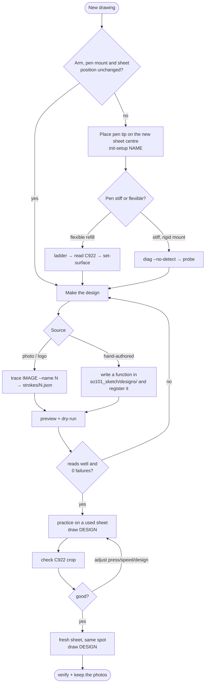

# How to draw something new

Two cases: **same physical setup, new picture** (minutes), or **anything physical changed**
(re-calibrate first, ~15 minutes).



All commands below are `python scripts/so101_sketch.py …` (add `--setup calibration/setups/NAME.json`
when not using the default profile). Start the camera dashboards first (see [CAMERAS.md](CAMERAS.md)).

## A. Same setup, new picture

1. **Make the design.**
   * Quick: trace a photo or logo.
     ```bash
     python scripts/so101_sketch.py trace references/my_picture.jpg --name my_picture          # photos (edges)
     python scripts/so101_sketch.py trace references/my_logo.png --name my_logo --mode outline  # silhouettes
     ```
     Tune `--max-strokes` (fewer = cleaner), `--min-len-px` (drop specks), `--simplify-px`.
   * Best results: hand-author strokes like `so101_sketch/designs/petronas.py`. Work in
     normalised `(u, v)` with `u` right and `v` up as in the reference picture. Build a silhouette
     layer first, then a detail layer. Register the function in `designs/__init__.py::DESIGNS`.
     Tips that worked: long continuous strokes, one stroke per outline, keep features ≥ 3 mm at the
     final size, use `bold()` for outlines, keep a margin of 2 % so nothing falls off the area.
2. **Preview and dry-run.**
   ```bash
   python scripts/so101_sketch.py preview my_picture        # -> work/live/my_picture-preview.png
   python scripts/so101_sketch.py dry-run strokes/my_picture.json
   ```
   The dry-run must report `"n_failures": 0`. It also estimates the duration (real runs take about
   1.3× longer).
3. **Practice** on a used sheet (offset the area with `--centre-xy` if needed), check the C922
   image, adjust `--press-mm` (darker) or `--speed` (cleaner corners).
4. **Final**: fresh sheet exactly where the previous one was, then
   ```bash
   python scripts/so101_sketch.py draw strokes/my_picture.json --tag my_picture
   ```
   The command homes, draws, parks the arm toward the robot and saves before/after snapshots in
   `work/live/`. Touch up individual strokes with `--only 3,7,12`.

## B. Something physical changed

1. **Mount the pen** rigidly and pointing down. A bare refill works; a long pen taped at an
   unknown angle does not (see [LESSONS_LEARNED.md](LESSONS_LEARNED.md)).
2. **Pose the arm by hand** (torque off, or jog) so the pen tip rests on the paper where the
   drawing centre should go, in a comfortable mid-reach posture (wrist not at a limit).
3. **Capture a profile** from that pose:
   ```bash
   python scripts/so101_sketch.py init-setup my_setup --area-mm 130,170 --toward-robot-mm 15
   ```
   This stores the pen axis/length/lean, home seed and drawing centre in
   `calibration/setups/my_setup.json` (no paper surface yet).
4. **Check reachability**: `status --setup calibration/setups/my_setup.json` prints a table over
   the rectangle; shrink `area_mm` or move `centre_xy_m` toward the robot if cells show `XX` or
   the pitch change exceeds ~10°.
5. **Measure the paper surface.**
   * Flexible pen → ink ladder:
     ```bash
     python scripts/so101_sketch.py ladder --setup calibration/setups/my_setup.json \
         --levels-mm 20,17,14,11,8,5          # coarse first: find the band where ink starts
     python scripts/so101_sketch.py ladder --setup calibration/setups/my_setup.json \
         --levels-mm 12,10.5,9,7.5,6,4.5      # then fine steps around it
     ```
     Crop the C922 image around the right margin. For each of the three reaches the highest
     inked level is the surface there. Then
     `set-surface --setup … --z0-mm <value at the centre> --slope-x <(far − near) / Δx in mm per m>`.
   * Stiff mount → `diag --no-detect` (check the lag curve has a clear knee), then `probe`.
6. Continue with case A.

## Choosing the drawing area

* Letter paper is 216 × 279 mm; 130 × 170 mm (≈ 60 % of the sheet) kept the pen attitude within 5°.
* Reach is the constraint: far from the robot the arm sags more, near the robot the wrist runs
  into its limit. Pull the centre toward the robot rather than past the sheet centre.
* `u` is the viewer's right and `v` points to the robot: designs come out upright to the C922.
